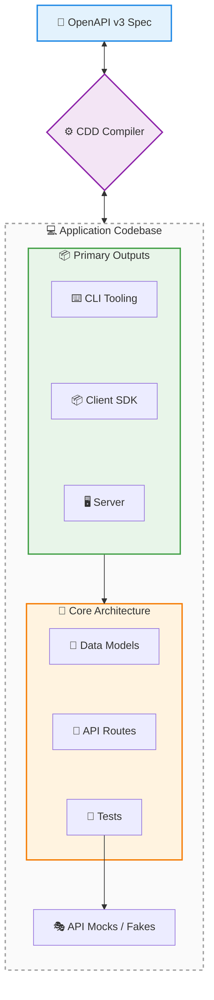

cdd-ts
============

[](https://opensource.org/licenses/Apache-2.0)
[](https://offscale.io/wasm_web_demo)
[](https://github.com/offscale/cdd-ts/actions)
[](#)
[](#)

**Compiler Driven Development (CDD)** is a development approach designed to eradicate the disconnect between: API specifications; server implementations; client SDKs; and command-line tooling.

Unlike traditional code generators—that treat outputs as disposable or read-only—CDD provides a **complete, standalone compiler** for each supported language. These compilers are fully CST-aware (Concreate Syntax Tree is a whitespace+comment aware Abstract Syntax Tree), allowing true bidirectional synchronization between existing hand-edited source code and OpenAPI specifications.

---

## 🏗️ The Standalone Compiler Architecture

Traditional tools use naïve templating—if you regenerate, your custom code is overwritten. 

The CDD ecosystem is fundamentally different. It utilizes language-specific, standalone compilers capable of full AST parsing, semantic diffing, and surgical patching.

**The Core Guarantee:** Every part of the generated codebase is fully editable. 
You are encouraged to open the generated routing files, model definitions, and CLI structures, and directly inject your business logic. 

- **When your specification changes**, the CDD compiler reads your code, builds an AST, diffs it against the new spec, and safely patches in new endpoints or fields without touching your custom logic.
- **When your codebase changes**, the compiler reverse-engineers your structural updates back into a 100% accurate, authoritative OpenAPI specification.

---

## 🔄 The Bidirectional Synchronization Loop



The CDD lifecycle supports continuous evolution from any starting point:
1. **Generate**: Scaffold servers, SDKs, or CLIs from a central specification.
2. **Edit**: Developers write real, unconstrained code directly in the generated files.
3. **Extract**: Reverse-compile the edited code to produce an updated OpenAPI spec.
4. **Sync**: Apply new specification changes seamlessly into the existing, hand-edited codebase.

---

## 🌐 The Global Language Ecosystem

Every supported language operates on the same core CDD philosophies but is powered by a dedicated, native compiler tailored to that language's specific AST, idioms, and package management.

All implementations share a standardized CLI interface (`cdd [subcommand]`), acting as a universal toolchain.

| Repository | Language | Client; Client CLI; Server | Extra features | Standards | CI Status |
|---|---|---|---|---|---|
| [`cdd-c`](https://github.com/SamuelMarks/cdd-c) | C (C89) | Client; Client CLI; Server | FFI | Swagger 2.0 & OpenAPI 3.2.0 | [](https://github.com/SamuelMarks/cdd-c/actions/workflows/ci.yml) |
| [`cdd-cpp`](https://github.com/SamuelMarks/cdd-cpp) | C++ | Client; Client CLI; Server | Upgrades Swagger & Google Discovery to OpenAPI 3.2.0 | Google Discovery; Swagger 2.0 & OpenAPI 3.2.0 | [](https://github.com/SamuelMarks/cdd-cpp/actions/workflows/ci.yml) |
| [`cdd-csharp`](https://github.com/SamuelMarks/cdd-csharp) | C# | Client; Client CLI; Server | CLR | Swagger 2.0 & OpenAPI 3.2.0 | [](https://github.com/SamuelMarks/cdd-csharp/actions/workflows/ci.yml) |
| [`cdd-go`](https://github.com/SamuelMarks/cdd-go) | Go | Client; Client CLI; Server | | Swagger 2.0 & OpenAPI 3.2.0 | [](https://github.com/SamuelMarks/cdd-go/actions/workflows/ci.yml) |
| [`cdd-java`](https://github.com/SamuelMarks/cdd-java) | Java | Client; Client CLI; Server | | Swagger 2.0 & OpenAPI 3.2.0 | [](https://github.com/SamuelMarks/cdd-java/actions/workflows/ci.yml) |
| [`cdd-kotlin`](https://github.com/offscale/cdd-kotlin) | Kotlin (ktor for Multiplatform) | Client; Client CLI; Server | Auto-Admin UI | Swagger 2.0 & OpenAPI 3.2.0 | [](https://github.com/offscale/cdd-kotlin/actions/workflows/ci.yml) |
| [`cdd-php`](https://github.com/SamuelMarks/cdd-php) | PHP | Client; Client CLI; Server | | Swagger 2.0 & OpenAPI 3.2.0 | [](https://github.com/SamuelMarks/cdd-php/actions/workflows/ci.yml) |
| [`cdd-python`](https://github.com/offscale/cdd-python) | Python | N/A (server building blocks) | CLI ↔ SQL ↔ Pydantic ↔ docs ↔ JSON-schema | N/A | [](https://github.com/offscale/cdd-python/actions) |
| [`cdd-python-all`](https://github.com/offscale/cdd-python-all) | Python | Client; Client CLI; Server |  | Swagger 2.0 & OpenAPI 3.2.0 | [](https://github.com/offscale/cdd-python-all/actions/workflows/ci.yml) |
| [`cdd-ruby`](https://github.com/SamuelMarks/cdd-ruby) | Ruby | Client; Client CLI; Server |  | Swagger 2.0 & OpenAPI 3.2.0 | [](https://github.com/SamuelMarks/cdd-ruby/actions/workflows/ci.yml) |
| [`cdd-rust`](https://github.com/SamuelMarks/cdd-rust) | Rust | Client; Client CLI; Server |  | Swagger 2.0 & OpenAPI 3.2.0 | [](https://github.com/offscale/cdd-rust/actions/workflows/ci.yml) |
| [`cdd-sh`](https://github.com/SamuelMarks/cdd-sh) | Shell (/bin/sh) | Client; Client CLI; Server |  | Swagger 2.0 & OpenAPI 3.2.0 | [](https://github.com/SamuelMarks/cdd-sh/actions/workflows/ci.yml) |
| [`cdd-swift`](https://github.com/SamuelMarks/cdd-swift) | Swift | Client; Client CLI; Server |  | Swagger 2.0 & OpenAPI 3.2.0 | [](https://github.com/SamuelMarks/cdd-swift/actions/workflows/ci.yml) |
| [`cdd-ts`](https://github.com/offscale/cdd-ts) | TypeScript | Client; Client CLI; Server | Auto-Admin UI; Angular; React; Vue; fetch; Axios; Node.js | Swagger 2.0 & OpenAPI 3.2.0 | [](https://github.com/offscale/cdd-ts/actions/workflows/ci.yml) |

---

## 🛠️ Universal CLI Toolchain

A true ecosystem requires standardized tooling. Once a developer learns the CDD toolchain, they can synchronize architecture across the entire polyglot stack.

### Global Arguments

- `--help`: Print help information.
- `--version`: Print version information.
- `--input, -i` (or `-f`): Target file, directory, or OpenAPI spec.
- `--output, -o`: Destination path for generation or sync.

### Core Subcommands

#### `from_openapi to_sdk_cli`
```text
Usage: cdd-ts from_openapi to_sdk_cli [options]

Generate Client SDK CLI from an OpenAPI specification

Options:
  -c, --config <path>                Path to a configuration file (env: CDD_CONFIG)
  -i, --input <path>                 Path or URL to the OpenAPI specification.
  --input-dir <path>                 Path to directory of OpenAPI specs (env: CDD_INPUT_DIR)
  -o, --output <path>                Output directory for generated files (env: CDD_OUTPUT)
  --dateType <type>                  Date type to use (choices: "string", "Date", env: CDD_DATE_TYPE)
  --enumStyle <style>                Style for enums (choices: "enum", "union", env: CDD_ENUM_STYLE)
  --int64Type <type>                 Type for int64 formatting (choices: "number", "string", "bigint",
                                     env: CDD_INT64_TYPE)
  --no-test-gen                      Disable all test generation (env: CDD_NO_TEST_GEN)
  --tests                            Generate integration tests and mocks. (env: CDD_TESTS)
  --mcp                              Generate Model Context Protocol (MCP) server and adapter. (env:
                                     CDD_MCP)
  --no-github-actions                Do not generate GitHub Actions scaffolding. (env:
                                     CDD_NO_GITHUB_ACTIONS)
  --no-installable-package           Do not generate installable package scaffolding. (env:
                                     CDD_NO_INSTALLABLE_PACKAGE)
  --clientName <name>                Name for the generated client (env: CDD_CLIENT_NAME)
  --framework <framework>            Target framework (choices: "angular", "react", "vue", "vanilla",
                                     "Vanilla JS", env: CDD_FRAMEWORK)
  --implementation <implementation>  HTTP implementation (choices: "angular", "fetch", "axios", "node",
                                     env: CDD_IMPLEMENTATION)
  --platform <platform>              Target runtime platform (choices: "browser", "node", env:
                                     CDD_PLATFORM)
  --customHeader <header...>         Custom headers to add to generated requests, formatted as Key:Value
  --admin                            Generate an auto-admin UI (env: CDD_ADMIN)
  --no-generate-services             Disable generation of services (env: CDD_NO_GENERATE_SERVICES)
  --no-tests-for-service             Disable generation of tests for services (env:
                                     CDD_NO_TESTS_FOR_SERVICE)
  --no-tests-for-admin               Disable generation of tests for the admin UI (env:
                                     CDD_NO_TESTS_FOR_ADMIN)
  -h, --help                         display help for command
```

#### `from_openapi to_sdk`
```text
Usage: cdd-ts from_openapi to_sdk [options]

Generate Client SDK from an OpenAPI specification

Options:
  -c, --config <path>                Path to a configuration file (env: CDD_CONFIG)
  -i, --input <path>                 Path or URL to the OpenAPI specification.
  --input-dir <path>                 Path to directory of OpenAPI specs (env: CDD_INPUT_DIR)
  -o, --output <path>                Output directory for generated files (env: CDD_OUTPUT)
  --dateType <type>                  Date type to use (choices: "string", "Date", env: CDD_DATE_TYPE)
  --enumStyle <style>                Style for enums (choices: "enum", "union", env: CDD_ENUM_STYLE)
  --int64Type <type>                 Type for int64 formatting (choices: "number", "string", "bigint",
                                     env: CDD_INT64_TYPE)
  --no-test-gen                      Disable all test generation (env: CDD_NO_TEST_GEN)
  --tests                            Generate integration tests and mocks. (env: CDD_TESTS)
  --mcp                              Generate Model Context Protocol (MCP) server and adapter. (env:
                                     CDD_MCP)
  --no-github-actions                Do not generate GitHub Actions scaffolding. (env:
                                     CDD_NO_GITHUB_ACTIONS)
  --no-installable-package           Do not generate installable package scaffolding. (env:
                                     CDD_NO_INSTALLABLE_PACKAGE)
  --clientName <name>                Name for the generated client (env: CDD_CLIENT_NAME)
  --framework <framework>            Target framework (choices: "angular", "react", "vue", "vanilla",
                                     "Vanilla JS", env: CDD_FRAMEWORK)
  --implementation <implementation>  HTTP implementation (choices: "angular", "fetch", "axios", "node",
                                     env: CDD_IMPLEMENTATION)
  --platform <platform>              Target runtime platform (choices: "browser", "node", env:
                                     CDD_PLATFORM)
  --customHeader <header...>         Custom headers to add to generated requests, formatted as Key:Value
  --admin                            Generate an auto-admin UI (env: CDD_ADMIN)
  --no-generate-services             Disable generation of services (env: CDD_NO_GENERATE_SERVICES)
  --no-tests-for-service             Disable generation of tests for services (env:
                                     CDD_NO_TESTS_FOR_SERVICE)
  --no-tests-for-admin               Disable generation of tests for the admin UI (env:
                                     CDD_NO_TESTS_FOR_ADMIN)
  -h, --help                         display help for command
```

#### `from_openapi to_server`
```text
Usage: cdd-ts from_openapi to_server [options]

Generate Server from an OpenAPI specification

Options:
  -c, --config <path>       Path to a configuration file (env: CDD_CONFIG)
  -i, --input <path>        Path or URL to the OpenAPI specification.
  --input-dir <path>        Path to directory of OpenAPI specs (env: CDD_INPUT_DIR)
  -o, --output <path>       Output directory for generated files (env: CDD_OUTPUT)
  --dateType <type>         Date type to use (choices: "string", "Date", env: CDD_DATE_TYPE)
  --enumStyle <style>       Style for enums (choices: "enum", "union", env: CDD_ENUM_STYLE)
  --int64Type <type>        Type for int64 formatting (choices: "number", "string", "bigint", env:
                            CDD_INT64_TYPE)
  --no-test-gen             Disable all test generation (env: CDD_NO_TEST_GEN)
  --tests                   Generate integration tests and mocks. (env: CDD_TESTS)
  --mcp                     Generate Model Context Protocol (MCP) server and adapter. (env: CDD_MCP)
  --no-github-actions       Do not generate GitHub Actions scaffolding. (env: CDD_NO_GITHUB_ACTIONS)
  --no-installable-package  Do not generate installable package scaffolding. (env:
                            CDD_NO_INSTALLABLE_PACKAGE)
  --serverFramework <type>  Target server framework (choices: "express", "node", "bun", "deno", env:
                            CDD_SERVER_FRAMEWORK)
  --orm <type>              Target ORM implementation for models (choices: "typeorm", env: CDD_ORM)
  -h, --help                display help for command
```

#### `from_openapi to_orm`
```text
Usage: cdd-ts from_openapi to_orm [options]

Generate ORM entities/models from an OpenAPI specification

Options:
  -c, --config <path>       Path to a configuration file (env: CDD_CONFIG)
  -i, --input <path>        Path or URL to the OpenAPI specification.
  --input-dir <path>        Path to directory of OpenAPI specs (env: CDD_INPUT_DIR)
  -o, --output <path>       Output directory for generated files (env: CDD_OUTPUT)
  --dateType <type>         Date type to use (choices: "string", "Date", env: CDD_DATE_TYPE)
  --enumStyle <style>       Style for enums (choices: "enum", "union", env: CDD_ENUM_STYLE)
  --int64Type <type>        Type for int64 formatting (choices: "number", "string", "bigint", env:
                            CDD_INT64_TYPE)
  --no-test-gen             Disable all test generation (env: CDD_NO_TEST_GEN)
  --tests                   Generate integration tests and mocks. (env: CDD_TESTS)
  --mcp                     Generate Model Context Protocol (MCP) server and adapter. (env: CDD_MCP)
  --no-github-actions       Do not generate GitHub Actions scaffolding. (env: CDD_NO_GITHUB_ACTIONS)
  --no-installable-package  Do not generate installable package scaffolding. (env:
                            CDD_NO_INSTALLABLE_PACKAGE)
  --orm <type>              Target ORM implementation for models (choices: "typeorm", env: CDD_ORM)
  -h, --help                display help for command
```

#### `to_openapi`
```text
Usage: cdd-ts to_openapi [options]

Generate an OpenAPI specification from source code.

Options:
  -i, --input <path>   Path to a snapshot file or a generated output directory (env: CDD_INPUT)
  -o, --output <path>  Output file (env: CDD_OUTPUT)
  --format <format>    Output format for the OpenAPI spec (choices: "json", "yaml", default: "yaml",
                       env: CDD_FORMAT)
  --orm <type>         Target ORM implementation to parse entities from (choices: "typeorm", env:
                       CDD_ORM)
  -h, --help           display help for command
```

#### `to_docs_json`
```text
Usage: cdd-ts to_docs_json [options]

Generate JSON documentation with code snippets for an OpenAPI specification.

Options:
  -i, --input <path>       Path or URL to the OpenAPI specification. (env: CDD_INPUT)
  -o, --output <path>      Path to write the JSON to (env: CDD_OUTPUT)
  --framework <framework>  Target framework (choices: "angular", "react", "vue", "vanilla", "Vanilla
                           JS", default: "vanilla", env: CDD_FRAMEWORK)
  --no-imports             Omit the imports field. (env: CDD_NO_IMPORTS)
  --no-wrapping            Omit the wrapper fields. (env: CDD_NO_WRAPPING)
  -h, --help               display help for command
```

#### `serve_json_rpc`
```text
Usage: cdd-ts serve_json_rpc [options]

Expose CLI interface as a JSON-RPC server.

Options:
  -p, --port <port>       Port to listen on (default: "8080", env: CDD_PORT)
  -l, --listen <address>  Address to listen on (default: "127.0.0.1", env: CDD_LISTEN)
  -h, --help              display help for command
```

#### `sync`
```text
Usage: cdd-ts sync [options]

Bi-directional synchronization of contract implementations

Options:
  -i, --input <path>  Path to the source directory or file
  --truth <source>    Designate the single source of truth (choices: "class", "typeorm", "function",
                      "openapi")
  -h, --help          display help for command
```

#### `mcp`
```text
Usage: cdd-ts mcp [options]

Start Model Context Protocol (MCP) server over stdio

Options:
  -h, --help  display help for command
```

### Detail Features Beyond Common Subset

- **Rich Frontend Framework Support**: First-class support for generating specific UI implementations across Angular, React, Vue, and Vanilla JS (`--framework` flag).
- **Multiple HTTP Implementations**: Generate clients tailored to fetch, axios, angular's HttpClient, or Node's HTTP (`--implementation` flag).
- **TypeORM Integration**: End-to-end ORM support with `--orm typeorm`, enabling generation of entities directly from OpenAPI specs, and extraction of OpenAPI specs natively from your TypeORM models.
- **Server Framework Support**: Scaffold servers seamlessly using Express, Node (native), Bun, or Deno (`--serverFramework` flag).
- **Auto-Admin UI**: Automatic generation of Admin dashboards based on the spec via the `--admin` flag.
- **Model Context Protocol (MCP)**: Native support for generating and acting as an MCP server with `--mcp` flag and the `mcp` subcommand.
- **Advanced Synchronization**: The `sync` command provides powerful bidirectional synchronization where developers can specify the single source of truth (`--truth`) seamlessly transitioning between OpenAPI specs, TypeORM models, classes, and standalone functions.

---

## 🚀 The End of "Spec Drift"

With Compiler Driven Development, specifications and code are no longer loosely coupled artifacts. They are strict, isomorphic reflections of one another, maintained by dedicated standalone compilers. 

Choose your language ecosystem above and start treating your architecture as a seamlessly compiled, endlessly editable whole.

---

## License

Licensed under either of

- Apache License, Version 2.0 ([LICENSE-APACHE](LICENSE-APACHE) or <https://www.apache.org/licenses/LICENSE-2.0>)
- MIT license ([LICENSE-MIT](LICENSE-MIT) or <https://opensource.org/licenses/MIT>)

at your option.

### Contribution

Unless you explicitly state otherwise, any contribution intentionally submitted
for inclusion in the work by you, as defined in the Apache-2.0 license, shall be
dual licensed as above, without any additional terms or conditions.

